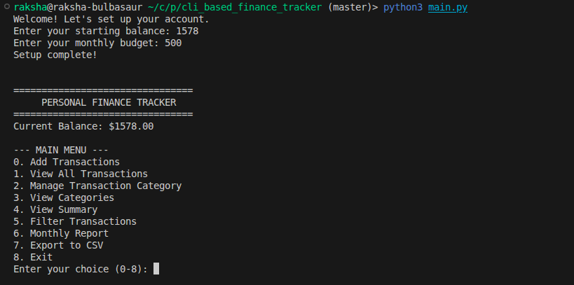
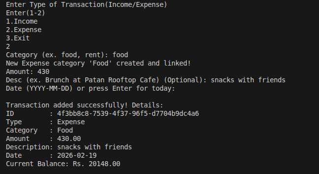
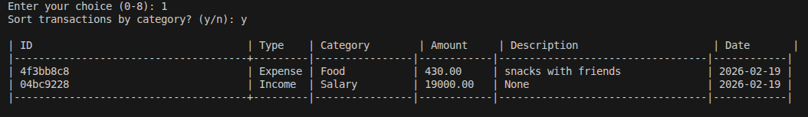
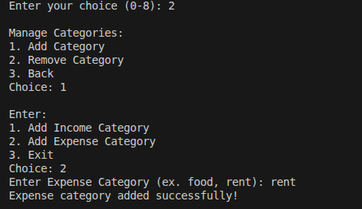
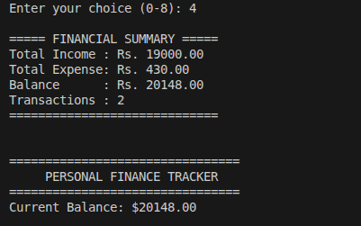
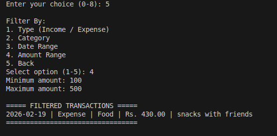
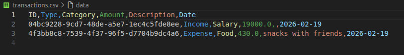
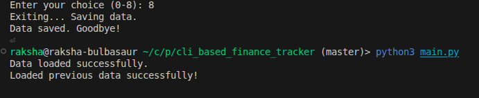

# 🏦 CLI Personal Finance Tracker

# CLI Finance Tracker

[](https://pypi.org/project/finance-tracker/)


A simple and powerful **command-line interface (CLI) Personal Finance Tracker** that helps you manage your income, expenses, and budget efficiently. Track transactions, view summaries, generate monthly reports, filter data, and export to CSV — all from your terminal!  

---

## 📸 Screenshots

### 1️⃣ Welcome Prompt
<p align="center">
  
</p>

---

### 2️⃣ Add Transaction
<p align="center">
  
</p>

---

### 3️⃣ View Transactions
<p align="center">
  
</p>

---

### 4️⃣ Manage Categories
<p align="center">
  
</p>

---

### 5️⃣ Financial Summary
<p align="center">
  
</p>

---

### 6️⃣ Filter Transactions
<p align="center">
  
</p>

---

### 7️⃣ Monthly Report
<p align="center">
  
</p>

---

### 8️⃣ Export to CSV
<p align="center">
  
</p>

---

### 9️⃣ JSON Data
<p align="center">
  
</p>

---

### 🔟 Store Data Persistently
<p align="center">
  
</p>


## 🚀 Features

### 1. Add Transactions
- Add **Income** or **Expense** transactions.
- Assign transactions to existing categories or create **new categories on the fly**.
-  Categories are linked to transactions automatically.
- Enter a **custom date** or default to today.

### 2. View All Transactions
- List all transactions in a **tabular format**.
- Option to **sort by category**.
- Displays **ID, Type, Category, Amount, Description, Date, and Current Balance**.

### 3. Manage Transaction Categories
- **Add new categories** for Income or Expense.
- **Remove categories** easily.
-  View all categories or filter by **Income / Expense**


### 5. View Summary
- Provides a **financial overview**:
  - Total Income
  - Total Expenses
  - Current Balance
  - Total number of transactions

### 6. Filter Transactions
- Filter by:
  - **Type** (Income / Expense)
  - **Category**
  - **Date range**
  - **Amount range**

### 7. Monthly Report
- Generate a **monthly financial report**:
  - Total Income and Expenses for the month
  - **Net Savings**
  - **Expense breakdown by category**
  - **Highest expense category**
  - **Comparison with previous month** (if data exists)

### 8. Export Transactions
- Export all transactions to **CSV** for external analysis.

### 9. Budget Warnings
- Set an initial **balance** and **monthly budget**.
- Receive warnings when expenses exceed the budget.

### 10. Data Persistence
- All transactions and categories are saved in **JSON**, so your data persists even after closing the program.

---

## 💻 Installation

1. Clone the repository:

```bash
git clone https://github.com/your-username/cli-personal-finance-tracker.git
cd cli-personal-finance-tracker
```
2. Run the program:
 ```bash
  python main.py
  ```
  